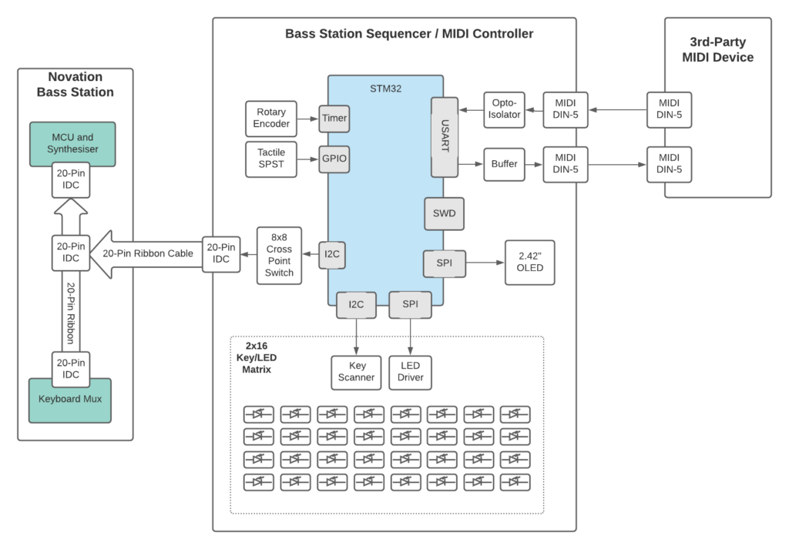
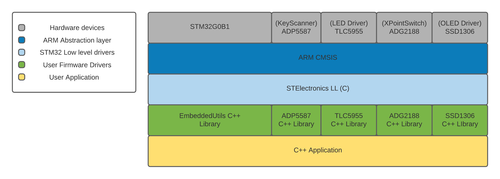
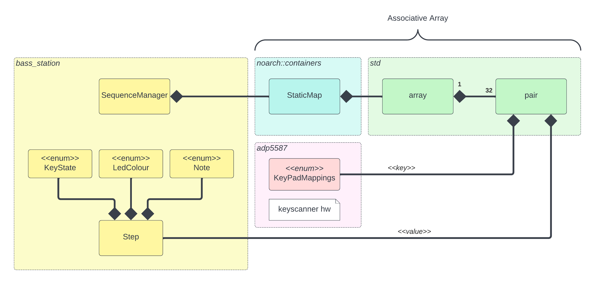
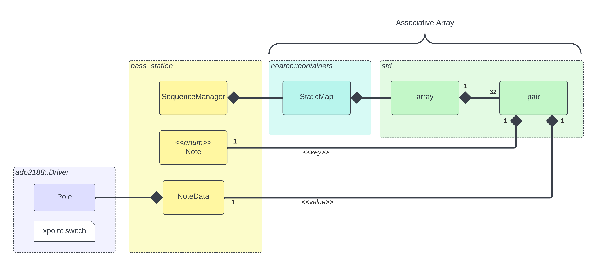

## HW Sequencer for Novation BassStation Synth

### Front Panel Design

- HW sequencer for Novation BassStation
- 32-step pattern with individual note assignment.
- Silicone rubber step buttons with 16bit RGB colour.
- Tempo adjustment.
- MIDI support for controlling external drum machine

### Architecture Overview

The sequencer runs an Arm-Cortex M0+. Aside from the regular STM32 peripheral set, the system also has dedicated chips for the:

- RGB LED sequence pattern
- FIFO for storing keypress events
- OLED 2.42" display
- 8x8 Crosspoint switch (for triggering the notes on the BassStation)

The triggering of notes on the BassStation is achieved via a ribbon cable connected from the HW sequencer to the internal BassStation cable. A dedicated 8x8 crosspoint switch is used to close the contacts to trigger a note on the synth. Note, a modification is required to the BassStation's internal ribbon cable.
 

The overal architecture of the SW and HW is divided up between vendor provided libraries and libraries written by myself.  Use of the LL library - provided by STMicroelectronics - is gradually fazed out as the project is concluded.

### Mapping keypresses to sequencer step position

The key press event IDs from the ADP5587 IC are stored in an enumeration - [adp5587::KeyPadMappings](https://github.com/cracked-machine/cpp_adp5587/blob/9a02c9eafbfd2683928fbeff43ed2d1c2e171415/inc/adp5587_common.hpp#L113) - in the adp5587 driver.

In order to map these IDs to the steps in the sequencer pattern, an associative array is used. Note there are 32 steps in the pattern, one for each physical button on the HW sequencer.

Since `std::map` uses dynamic allocation, a custom statically allocated map was created. This uses a `std::array` of `std::pairs`. The first item in the pair is the map _key_, the second item in the pair is the map _value_.

Each `Step` object has a `KeyState` (on/off), a RDG `LedColour` and a `Note` (any note between C0-C2).

### Mapping notes to crosspoint switch poles

To map each `Note` to a switch `Pole` another statically-allocated associative array is used. The `Note` object is the map _key_ and a  `NoteData` object is used as the map _value_ to store both the `Pole` object and other useful data.

### Further documentation

Hardware design [[1](https://github.com/cracked-machine/BassStationSequencerMidiController)]

Development tool installation [[2](doc/setup.md)]

Building this repo [[3](doc/building.md)]

STM32 device configuration report (out of date) [[4](stm32cube_workspace/G0B1KET6N/G0B1KET6N.pdf)]

UnitTest code coverage report (out of date) [[5](coverage/code.pdf)]